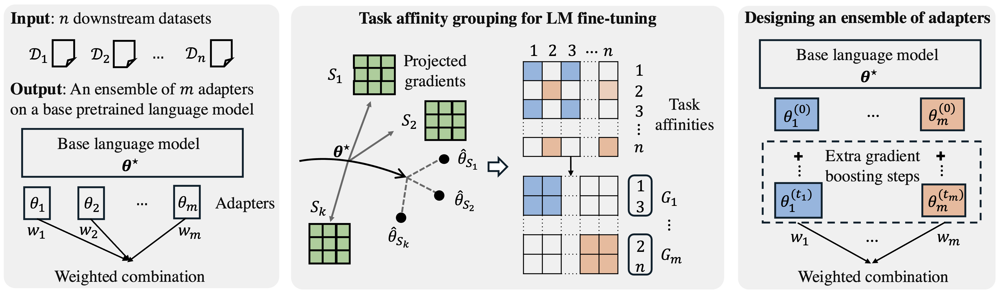

# Efficient Ensemble for Fine-tuning Language Models on Multiple Datasets
- Authors: [Dongyue Li](https://lidongyue12138.github.io/), [Ziniu Zhang](https://ziniuzhang.github.io/), [Lu Wang](https://web.eecs.umich.edu/~wangluxy/) and [Hongyang R. Zhang](https://www.hongyangzhang.com/)
- Paper: [arXiv](https://arxiv.org/abs/2505.21930)



## Overview

This code implements an ensemble method of low-rank adapters for adapting language models across multiple datasets. First, we develop an efficient task affinity grouping algorithm, with a first-order approximation for estimating task affinities and a clustering step to partition tasks into groups. Then, we construct an ensemble for groups of tasks, consisting of adapters fine-tuned on each group with additional boosting steps.

## Requirements

To build up the environment, please run the following commands.

```bash
conda create -n ensemble python=3.10
conda activate ensemble

pip install -r ./requirement.txt 
pip3 install torch torchvision torchaudio # check the pytorch version

mkdir ./results
mkdir ./external_lightning_logs
python setup.py develop

git clone https://github.com/bigscience-workshop/promptsource.git
cd promptsource/
pip install -e .
cd ../

pip install lightning==2.2.5
pip install pytorch-lightning==2.2.5
```

## Usage

We have implemented `LoRA`, `Bottleneck Adapter`, `QLoRA`, and `Quantized Bottleneck Adapter`. The corresponding arguments are `--train_lora`, `--train_adapter`, `--use_qlora`, `--use_qadapter`.

We provide a training script in `scripts/train.sh` as an example of fine-tuning a single adapter on the combination of all tasks.

### Stage 1: Task affinity grouping for LM fine-tuning

First, we evaluate and project gradients on the pretrained model of all training examples. Use the script `fast_estimate_compute_gradients_glue.py`. We provide an example to use the script in `scripts/eval_gradients.sh`. 

- `--compute_gradient_seeds` indicates the seed for generating a random projection matrix. This makes sure that we initialize the same projection matrix every time. 
- `--project_gradients_dim` indicates the projection dimension

This will create a folder under `gradients`, saving the initial adapter parameters and the projected gradients. 

Then, we will use the gradients as features to solve logistic regression. Use the script `fast_estimate_linear_regression_glue.py`. We provide an example to use the script in `scripts/solve_logistic_regression.sh`.

- `--number_of_subsets` controls the number of subsets of tasks to sample
- `--subset_size` controls the size of the subsets
- `--regularization_lambda` indicates the regularization strength when using the logistic regression. The range is usually between $1e-3$ and $1e-2$. 

This will generate a CSV file in the `results` folder, which saves all the evaluation results of the estimation. 

Finally, we apply a clustering algorithm to generate a partition of tasks. We provide an example in `clustering.py` to run examples of our clustering algorithms. 

### Stage 2: Designing an ensemble of adapters

After we generate a partition of tasks, we fine-tune one individual adapter on each cluster of tasks. This also uses the script `custom_train.py`. We show the script to train the adapters on groups in `scripts/train_v2.py`

Then, we apply a gradient boosting procedure on the group with a high training error. We use the script `custom_train_boosting_model.py`. 

- `--train_gradient_boosting` activates the gradient boosting procedure. In addition, we provide an implementation of adaboosting through `--train_adaboosting`. 
- `--n_estimators` specifies the number of boosting steps. 
- `--gradient_boosting_lr` specifies the learning rate of each boosting step. 
- `--lr_alpha` specifies the L2 regularization strength in solving the linear regression in each boosting step. 

Finally, we apply a weighted combination of the trained adapters on top of a quantized pretrained model, by providing the path to each of the adapter weights. 

We evaluate the memory cost of the ensemble models with  `measure_memory.py`. 

### Example of evaluating first-order approximation errors

Before running this example, please download the dataset for this example from [this link](https://github.com/HazyResearch/skill-it/tree/main/aux_data). We use an instruction dataset for evaluating the approximation errors. 

First, we evaluate and project gradients over all training samples through the script `fast_estimate_eval_approximation_alpaca.py` . Please see the example script in`/scripts/eval_errors.sh`. The important command arguments are as follows: 

- `--compute_pretrained_outputs` indicates computing the gradients at the pretrained initialization
- `--model_key` indicates the model name from the huggingface website
- `--save_name` indicates the name of the path to save the projected gradients 
- `--seed` indicates the seed to generate the projection matrix. 
- `--project_dimension` indicates the projection dimension of the gradients. 

Estimate linear regression models on subsets of clusters: `./script/alpaca/eval_approximation_err.sh`

Second, we evaluate the first-order approximation errors by using the projected gradients. This is also implemented in the script `fast_estimate_eval_approximation.py` . Please see the example script in`/scripts/eval_errors.sh`. The important command arguments are as follows: 

- `--scale` indicates the relative distance from the pretrained initialization. This should be calculated based on the relative scale to the initialized adapters. 
- `--save_name` should be the same as the one used for evaluating the gradient

## Reference
If you find this repository useful or happen to use it in a research paper, please cite our work with the following bib information

```
@article{Li2025efficient,
  title={Efficient Ensemble for Fine-tuning Language Models on Multiple Datasets},
  author={Li, Dongyue and Zhang, Ziniu and Wang, Lu and Zhang, Hongyang R},
  booktitle={Annual Meeting of the Association for Computational Linguistics (ACL)},
  year={2025},
}
```
